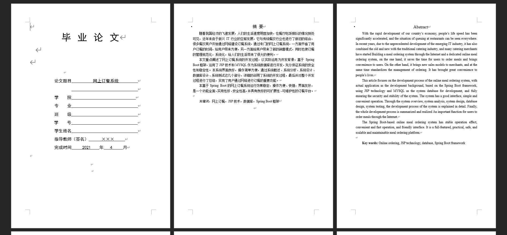
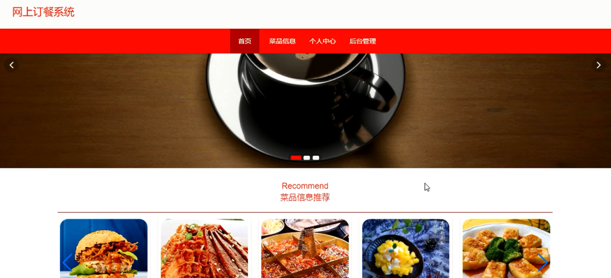
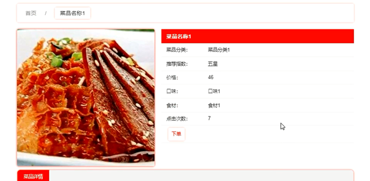
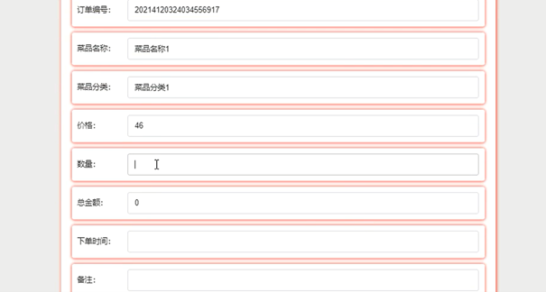
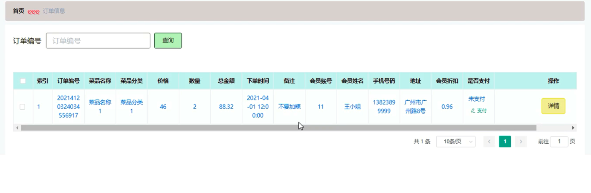
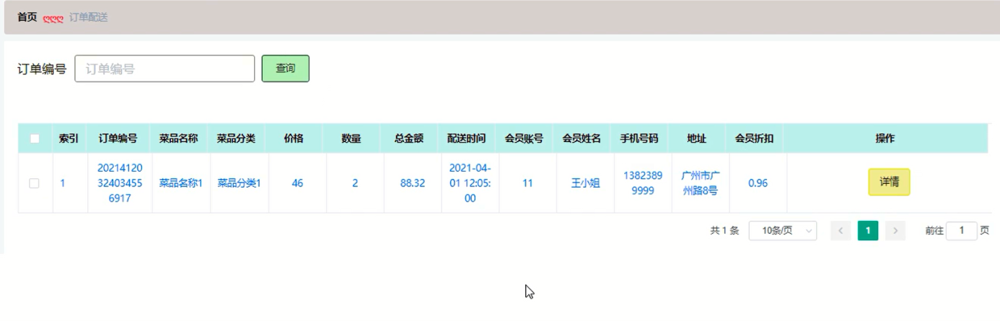

基于Springboot的网上订餐系统（程序+论文）
=
### 完整代码获取地址：从戎源码网 ([https://armycodes.com/](https://armycodes.com/))
### 作者微信：19941326836  QQ：952045282 
### 承接计算机毕业设计、Java毕业设计、Python毕业设计、深度学习、机器学习
### 选题+开题报告+任务书+程序定制+安装调试+论文+答辩ppt 一条龙服务
### 所有选题地址https://github.com/nature924/allProject

一、项目介绍
---
系统包含两种角色：用户、管理员，系统分为前台和后台两大模块，主要功能如下：
### 1 用户功能模块的实现
系统登录: 用户通过用户名和密码登录系统。
用户注册: 未注册用户可以进行注册操作。
菜品详情: 用户可以查看菜品详情信息，并在登录后进行下单操作。
下单订餐: 用户登录后可以选择菜品进行下单订餐操作。
订单信息: 用户可以查看和支付订单。
订单配送: 用户可以查看个人订单的配送信息。

### 2 管理员功能模块的实现
管理员登录: 管理员通过后台登录界面进入系统进行管理操作。
会员管理: 管理员可以查看、添加、修改和删除会员信息。
菜品信息管理: 管理员可以添加、修改和删除菜品信息。
菜品分类管理: 管理员可以增删改查菜品分类信息。
订单信息管理: 管理员可以查看所有订单信息，并进行安排配送、修改和删除操作。
订单配送管理: 管理员可以增删改查订单配送信息。

二、项目技术
---
- 编程语言：Java
- 数据库：MySQL
- 项目管理工具：Maven
- 前端技术：VUE、HTML、Jquery、Bootstrap
- 后端技术：Spring、SpringMVC、MyBatis

三、运行环境
---
- 操作系统：Windows、macOS都可以
- JDK版本：JDK1.8以上都可以
- 开发工具：IDEA、Ecplise、Myecplise都可以
- 数据库: MySQL5.7以上都可以
- Tomcat：任意版本都可以
- Maven：任意版本都可以

四、运行截图
---
### 论文截图：

### 程序截图：

